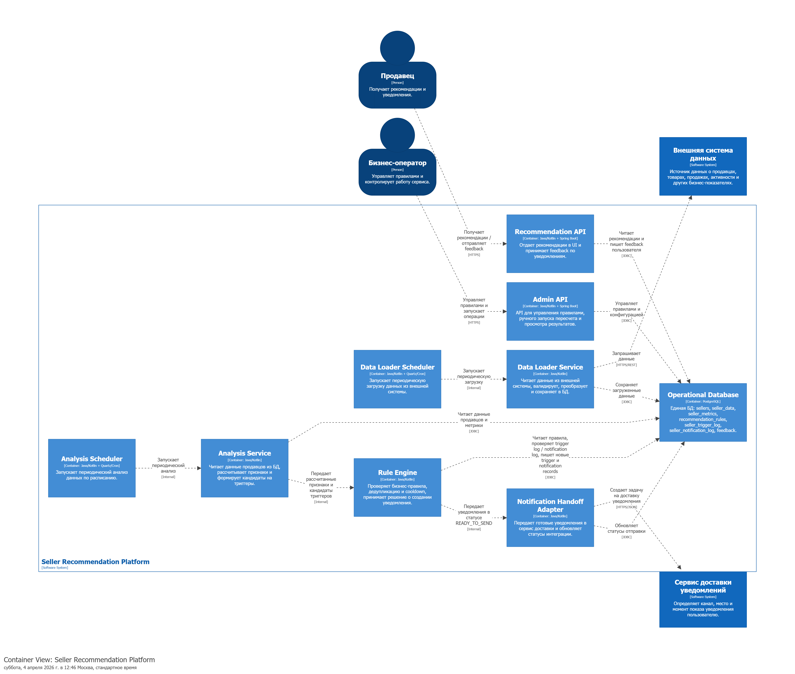
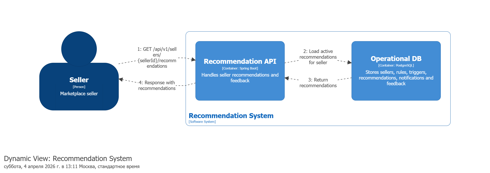
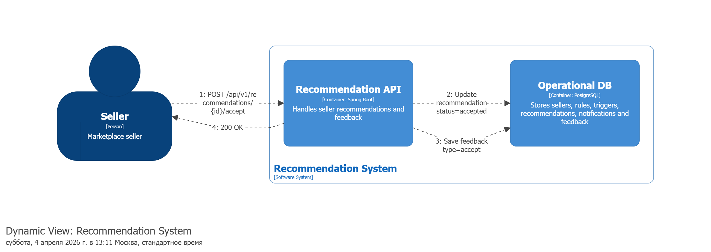
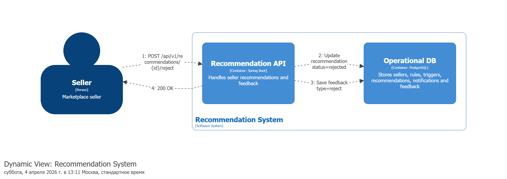
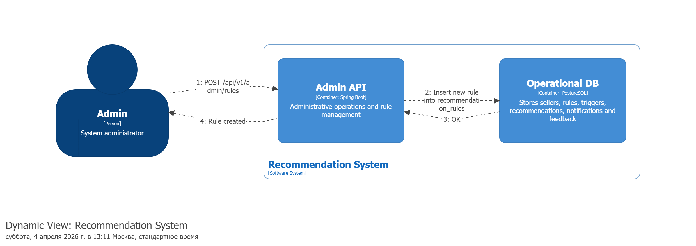
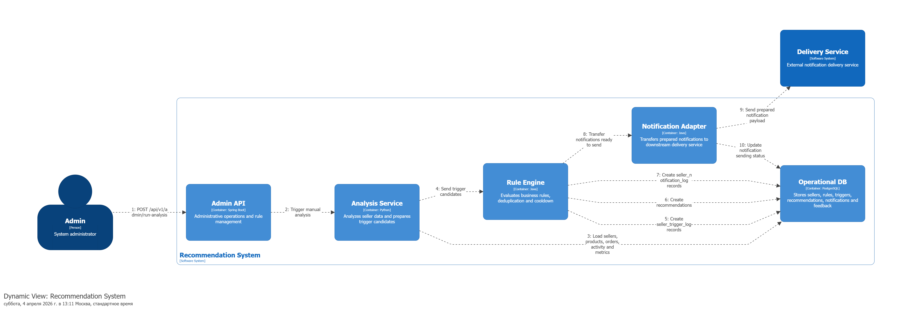

# Seller Recommendation Platform

Платформа для анализа данных продавцов и генерации персонализированных рекомендаций, помогающих развивать продажи, расширять ассортимент, подключать более подходящие модели продаж и вовремя реагировать на снижение активности.

Система ориентирована на текущих продавцов платформы и решает задачи активации, развития и реактивации. На текущем этапе сервис работает на основе периодической загрузки данных из внешней системы, анализа этих данных по набору бизнес-правил и передачи готовых уведомлений в отдельный сервис доставки уведомлений.

## Введение, описание проблемы

В экосистеме маркетплейса продавцы часто сталкиваются с одинаковыми проблемами:

- **не начинают продажи после регистрации** — зарегистрировались, но не добавили товары или не завершили публикацию;
- **теряют активность** — давно не заходят в кабинет, не пополняют остатки, снимают товары;
- **не используют потенциал платформы** — работают в одной категории, в ограниченной географии или только в одной модели продаж;
- **не получают своевременных рекомендаций** — система не подсказывает, какое следующее действие приведет к росту продаж или маржинальности.

Если не выявлять такие состояния автоматически, платформа теряет выручку, а продавец мотивацию и возможности для роста.

### Предлагаемое решение

Разрабатывается сервис рекомендаций продавцам, который:

- загружает и хранит данные о продавцах, товарах, заказах и активности из внешней системы;
- рассчитывает агрегаты и признаки продавца;
- определяет триггеры на основе бизнес-правил;
- формирует рекомендации и уведомления;
- передает уведомления в отдельный сервис доставки, который выбирает канал, место и момент показа.

На первом этапе система использует **rule-based подход**. В дальнейшем архитектура предусматривает подключение AI/ML-слоя для ranking/scoring рекомендаций и поиска next best action.

### Ключевые компоненты

- **Data Loader Service** — сервис загрузки данных из внешней системы.
- **Analysis Service** — сервис анализа данных продавцов и расчета признаков.
- **Rule Engine** — модуль применения бизнес-правил и формирования триггеров.
- **Recommendation API** — API для получения рекомендаций и фиксации действий пользователя.
- **Admin API** — API для управления правилами и запуска анализа.
- **Notification Handoff Adapter** — модуль передачи уведомлений в сервис доставки.
- **PostgreSQL** — основная база данных системы.

### Ожидаемый эффект

Разработка платформы позволит:

- увеличить долю активных продавцов;
- повысить конверсию продавцов из регистрации в первую продажу;
- сократить долю продавцов без продаж N дней;
- улучшить использование продавцами разных моделей продаж;
- централизовать логику рекомендаций и историю коммуникаций.

## Архитектура

Система представляет собой backend-платформу для анализа продавцов и генерации рекомендаций.

На текущем этапе архитектура строится вокруг одной PostgreSQL базы данных, отдельного слоя загрузки данных, отдельного слоя анализа и отдельного слоя передачи уведомлений.

### Описание архитектуры

Основные потоки в системе:

1. **Загрузка данных**
   - `Data Loader Scheduler` запускает периодическую загрузку;
   - `Data Loader Service` запрашивает данные из внешней системы;
   - загруженные данные сохраняются в PostgreSQL.

2. **Анализ и генерация рекомендаций**
   - `Analysis Scheduler` запускает batch-анализ;
   - `Analysis Service` читает данные продавцов и рассчитывает признаки;
   - `Rule Engine` применяет правила, проверяет дедупликацию и cooldown;
   - создаются триггеры, рекомендации и записи для уведомлений.

3. **Передача уведомлений**
   - `Notification Handoff Adapter` передает готовые уведомления в сервис доставки;
   - сервис доставки определяет канал и время показа уведомления.

4. **Обратная связь пользователя**
   - `Recommendation API` позволяет получить рекомендации и зафиксировать действия пользователя;
   - история реакций сохраняется в БД.

### Архитектурные слои

Проект построен по принципу разделения ответственности между слоями:

**External Data Source -> Data Loader -> PostgreSQL -> Analysis Service -> Rule Engine -> Notification Handoff -> Delivery Service**

### Основные компоненты

#### Admin API

API для бизнес-оператора.

Основные задачи:

- управление правилами рекомендаций;
- просмотр конфигурации и результатов;
- ручной запуск анализа.

#### Recommendation API

API для взаимодействия с рекомендациями.

Основные задачи:

- получение списка рекомендаций продавца;
- фиксация просмотра рекомендации;
- фиксация принятия или отклонения рекомендации.

#### Data Loader Scheduler

Планировщик загрузки данных.

Основные задачи:

- запуск job-ов загрузки;
- управление расписанием обновления данных.

#### Data Loader Service

Сервис загрузки данных.

Основные задачи:

- чтение данных из внешней системы;
- валидация и преобразование данных;
- сохранение данных в таблицы PostgreSQL.

#### Analysis Scheduler

Планировщик анализа.

Основные задачи:

- запуск batch-анализа по расписанию;
- контроль периодических пересчетов.

#### Analysis Service

Сервис анализа данных.

Основные задачи:

- чтение продавцов, товаров, заказов и активности;
- расчет snapshot-метрик;
- подготовка кандидатов на триггеры.

#### Rule Engine

Модуль бизнес-логики.

Основные задачи:

- проверка условий правил;
- дедупликация триггеров;
- проверка cooldown;
- создание рекомендаций.

#### Notification Handoff Adapter

Интеграционный модуль отправки уведомлений.

Основные задачи:

- формирование payload для downstream-сервиса;
- создание outbox-записей;
- retry при ошибках интеграции.

#### PostgreSQL

Основное хранилище системы.

В базе хранятся:

- продавцы;
- товары;
- заказы;
- активность продавца;
- агрегаты и snapshot-метрики;
- правила и шаблоны;
- триггеры;
- рекомендации;
- уведомления;
- feedback пользователя;
- технические job-логи.

### Взаимодействие компонентов

Основной поток генерации рекомендации:

1. Внешняя система предоставляет данные.
2. `Data Loader Service` загружает их в PostgreSQL.
3. `Analysis Service` формирует метрики продавца.
4. `Rule Engine` определяет, какие правила сработали.
5. Система создает recommendation и notification records.
6. `Notification Handoff Adapter` передает уведомление в сервис доставки.
7. Пользователь получает уведомление и может отреагировать на него.
8. `Recommendation API` сохраняет feedback.

### Функциональные требования

1. Система должна загружать данные продавцов из внешней системы.
2. Система должна сохранять историю загруженных данных и job-ов.
3. Система должна поддерживать периодический анализ продавцов.
4. Система должна определять триггеры по набору бизнес-правил.
5. Система должна создавать рекомендации на основе сработавших правил.
6. Система должна передавать уведомления в сервис доставки.
7. Система должна хранить историю уведомлений и действий пользователя.
8. Система должна предоставлять API для управления правилами.
9. Система должна предоставлять API для получения рекомендаций и фиксации feedback.

### Нефункциональные требования

1. Система должна поддерживать batch-анализ в заданное временное окно.
2. Архитектура должна позволять добавлять новые правила без изменения базовой схемы.
3. Архитектура должна поддерживать расширение под AI/ML scoring в будущем.
4. Система должна обеспечивать идемпотентность генерации рекомендаций.
5. Система должна поддерживать retry при ошибках отправки уведомлений.
6. Все ключевые операции должны логироваться и быть доступны для аудита.

## Бизнес-логика

### Цель сервиса

Цель сервиса — своевременно подсказывать продавцу следующее полезное действие, которое поможет увеличить продажи, активировать ассортимент или вернуться к работе.

### Классы сценариев

#### Активация

Примеры:

- продавец зарегистрировался, но не добавил товары;
- добавил товары, но не опубликовал;
- не завершил настройку модели продаж.

#### Развитие

Примеры:

- продавец стабильно продает и может расширить географию;
- продавцу подходит другая модель продаж;
- продавец может добавить новые категории или увеличить ассортимент.

#### Реактивация

Примеры:

- продавец давно не заходил;
- нет продаж N дней;
- сняты товары с публикации;
- закончились остатки.

### Жизненный цикл продавца

- `registered`
- `catalog_setup`
- `first_sales`
- `active`
- `growth`
- `stagnation`
- `churn_risk`
- `reactivated`

### Примеры триггеров

- `NO_PRODUCTS`
- `NO_SALES`
- `INACTIVE_SELLER`
- `NEW_CATEGORY`
- `HIGH_DEMAND_REGION`
- `OUT_OF_STOCK`

### Приоритеты рекомендаций

1. Активация продавца
2. Реактивация продавца
3. Рост продаж
4. Рост маржинальности
5. Информационные рекомендации

### Ограничения по коммуникациям

- не более одного активного уведомления одного типа на продавца;
- повтор одинаковой рекомендации только после cooldown;
- дедупликация рекомендаций по правилу и периоду;
- уведомление не создается, если действие уже совершено.

## Архитектура базы данных

В проекте используется **PostgreSQL** как основная операционная БД.

### Основные группы таблиц

#### Справочники

- `regions`
- `categories`
- `recommendation_types`

#### Основные сущности

- `sellers`
- `seller_models`
- `seller_products`
- `seller_orders`
- `seller_activity_log`
- `seller_category_presence`

#### Агрегаты и аналитика

- `seller_metrics_snapshot`
- `seller_category_metrics`
- `seller_region_metrics`
- `seller_features`

#### Правила и коммуникации

- `recommendation_rules`
- `notification_templates`
- `seller_trigger_log`
- `recommendations`
- `seller_notification_log`
- `recommendation_feedback`
- `outbound_notification_queue`

#### Технические таблицы

- `data_load_jobs`
- `analysis_jobs`

### Логика связей

Центральная сущность — `sellers`.

От нее зависят:

- товары продавца;
- заказы продавца;
- активность продавца;
- snapshot-метрики;
- триггеры;
- рекомендации;
- уведомления;
- feedback.

Базовая цепочка данных:

**external data -> seller_products / seller_orders / seller_activity_log -> seller_metrics_snapshot -> seller_trigger_log -> recommendations -> seller_notification_log -> recommendation_feedback**

## Тех. стек

### Backend

#### Python / Java / Kotlin

На логическом уровне система разбита на backend-компоненты:

- сервис загрузки данных;
- сервис анализа;
- rule engine;
- API-слой для администратора и рекомендаций;
- интеграционный слой для отправки уведомлений.

Конкретная технологическая реализация может быть выбрана командой в зависимости от стандартов проекта.

#### PostgreSQL

PostgreSQL используется как основная база данных.

Причины выбора:

- реляционная модель хорошо подходит для связей между продавцами, триггерами, рекомендациями и уведомлениями;
- поддержка транзакций и ограничений целостности;
- удобство аналитических запросов и аудита;
- поддержка `jsonb` для гибких payload и feature-срезов.

### Архитектурные компоненты

#### Rule-Based Recommendation Engine

На текущем этапе сервис использует детерминированные бизнес-правила.

Преимущества:

- прозрачность логики;
- понятность для бизнеса;
- легкость дебага;
- возможность постепенно подключить AI без отказа от правил.

#### Outbox Pattern

Для надежной передачи уведомлений используется таблица `outbound_notification_queue`.

Преимущества:

- retry при ошибках;
- контроль статуса отправки;
- идемпотентность интеграции;
- разрыв между бизнес-транзакцией и внешним HTTP-вызовом.

## API

### Recommendation API

- `GET /api/v1/sellers/{sellerId}/recommendations`
- `POST /api/v1/recommendations/{id}/view`
- `POST /api/v1/recommendations/{id}/accept`
- `POST /api/v1/recommendations/{id}/reject`

### Admin API

- `GET /api/v1/admin/rules`
- `POST /api/v1/admin/rules`
- `PUT /api/v1/admin/rules/{ruleId}`
- `POST /api/v1/admin/run-analysis`

## Сценарии API и динамика взаимодействия

Ниже приведены основные прикладные сценарии взаимодействия компонентов системы.  
Они отражают фактическую логику Recommendation System и соответствуют реализованным endpoint’ам.

---

### Сценарий "Получение рекомендаций продавца"

#### Endpoint
`GET /api/v1/sellers/{sellerId}/recommendations`

#### Участники:
- Продавец
- Recommendation API
- Operational DB

#### Основной сценарий:
1. Продавец отправляет запрос на получение актуальных рекомендаций.
2. `Recommendation API` обращается к `Operational DB`.
3. Из базы загружаются активные рекомендации продавца.
4. `Recommendation API` возвращает ответ со списком рекомендаций.

#### Постусловия:
- Продавец получает актуальный список рекомендаций.
- Состояние рекомендаций при этом не изменяется.

---

### Сценарий "Просмотр рекомендации"

#### Endpoint
`POST /api/v1/recommendations/{id}/view`

#### Участники:
- Продавец
- Recommendation API
- Operational DB

#### Основной сценарий:
1. Продавец открывает рекомендацию.
2. `Recommendation API` обновляет статус рекомендации или уведомления в базе.
3. В `Operational DB` сохраняется запись о действии пользователя в `recommendation_feedback` с типом `view`.
4. API возвращает успешный ответ.

#### Постусловия:
- В системе зафиксирован факт просмотра рекомендации.
- Данные могут быть использованы для аналитики эффективности коммуникаций.

---

### Сценарий "Принятие рекомендации"

#### Endpoint
`POST /api/v1/recommendations/{id}/accept`

#### Участники:
- Продавец
- Recommendation API
- Operational DB

#### Основной сценарий:
1. Продавец принимает рекомендацию.
2. `Recommendation API` обновляет статус рекомендации.
3. В `Operational DB` сохраняется запись о действии пользователя в `recommendation_feedback` с типом `accept`.
4. API возвращает успешный ответ.

#### Постусловия:
- В системе сохранен факт принятия рекомендации.
- Статус рекомендации может быть переведен в `accepted`.

---

### Сценарий "Отклонение рекомендации"

#### Endpoint
`POST /api/v1/recommendations/{id}/reject`

#### Участники:
- Продавец
- Recommendation API
- Operational DB

#### Основной сценарий:
1. Продавец отклоняет рекомендацию.
2. `Recommendation API` обновляет статус рекомендации.
3. В `Operational DB` сохраняется запись о действии пользователя в `recommendation_feedback` с типом `reject`.
4. API возвращает успешный ответ.

#### Постусловия:
- В системе сохранен факт отказа от рекомендации.
- Статус рекомендации может быть переведен в `rejected`.

---

### Сценарий "Получение списка правил"

#### Endpoint
`GET /api/v1/admin/rules`

#### Участники:
- Бизнес-оператор
- Admin API
- Operational DB

#### Основной сценарий:
1. Оператор отправляет запрос на получение списка правил.
2. `Admin API` читает записи из таблицы `recommendation_rules`.
3. Список правил возвращается оператору.

#### Постусловия:
- Оператор получает актуальную конфигурацию правил системы.

---

### Сценарий "Создание нового правила"

#### Endpoint
`POST /api/v1/admin/rules`

#### Участники:
- Бизнес-оператор
- Admin API
- Operational DB

#### Основной сценарий:
1. Оператор отправляет новое правило в `Admin API`.
2. `Admin API` валидирует входные данные.
3. Новое правило сохраняется в `recommendation_rules`.
4. Оператор получает подтверждение успешного создания.

#### Постусловия:
- Новое правило доступно для следующих запусков анализа.

#### Альтернативный сценарий:
1. Передана некорректная конфигурация правила.
- `Admin API` отклоняет запрос и возвращает ошибку валидации.

---

### Сценарий "Ручной запуск анализа"

#### Endpoint
`POST /api/v1/admin/run-analysis`

#### Участники:
- Бизнес-оператор
- Admin API
- Analysis Service
- Operational DB
- Rule Engine
- Notification Adapter

#### Основной сценарий:
1. Оператор инициирует запуск анализа.
2. `Admin API` передает команду в `Analysis Service`.
3. `Analysis Service` загружает данные продавцов и агрегаты из `Operational DB`.
4. На основе данных рассчитываются признаки и кандидаты на триггеры.
5. `Analysis Service` передает результаты в `Rule Engine`.
6. `Rule Engine` применяет бизнес-правила, проверяет дедупликацию и cooldown.
7. В базе создаются записи в `seller_trigger_log`, `recommendations`, `seller_notification_log`.
8. `Rule Engine` передает готовые уведомления в `Notification Adapter`.
9. `Notification Adapter` формирует интеграционный payload и передает уведомление в downstream-сервис доставки.

#### Постусловия:
- В системе созданы новые рекомендации и уведомления для продавцов, удовлетворяющих условиям правил.

#### Альтернативный сценарий:
1. Для продавца уже существует активная рекомендация того же типа в текущем периоде.
- `Rule Engine` не создает дубликат из-за дедупликации или cooldown.

---

### Визуализация сценариев

Диаграммы выше построены с использованием Structurizr DSL и отражают реальные потоки взаимодействия между компонентами системы.

## Событийная модель

Система использует внутренние события для отслеживания этапов обработки.

### Trigger Events

- `NO_PRODUCTS`
- `NO_SALES`
- `INACTIVE_SELLER`
- `NEW_CATEGORY`
- `HIGH_DEMAND_REGION`

### Recommendation Events

- `RECOMMENDATION_CREATED`
- `RECOMMENDATION_SENT`
- `RECOMMENDATION_OPENED`
- `RECOMMENDATION_ACCEPTED`
- `RECOMMENDATION_REJECTED`

### System Events

- `DATA_LOAD_STARTED`
- `DATA_LOAD_FINISHED`
- `ANALYSIS_STARTED`
- `ANALYSIS_FINISHED`
- `NOTIFICATION_SENT`
- `NOTIFICATION_FAILED`

## Use Cases

### Сценарий "Активация нового продавца"

#### Участники:
- Продавец
- Система

#### Предусловие:
- Продавец зарегистрирован на платформе.
- В системе отсутствуют активные товары продавца.

#### Основной сценарий:
- Система загружает данные о продавце.
- Анализирует состояние продавца.
- Выявляет триггер `NO_PRODUCTS`.
- Формирует рекомендацию на добавление первых товаров.
- Передает уведомление в сервис доставки.

#### Альтернативный сценарий:
1. Продавец уже добавил товары до отправки уведомления.
- Система не создает уведомление.

#### Постусловия:
- Рекомендация сохранена в системе.
- Пользователь получил подсказку о следующем действии.

---

### Сценарий "Реактивация продавца без продаж"

#### Участники:
- Продавец
- Система

#### Предусловие:
- У продавца есть опубликованные товары.
- Продажи отсутствуют N дней.

#### Основной сценарий:
- Система рассчитывает snapshot продавца.
- Rule Engine фиксирует триггер `NO_SALES`.
- Создается рекомендация сменить модель продаж или расширить географию.
- Уведомление отправляется в сервис доставки.

#### Альтернативный сценарий:
1. Для продавца уже есть активная рекомендация того же типа.
- Новая рекомендация не создается из-за cooldown.

#### Постусловия:
- В истории рекомендаций сохраняется новая запись или факт пропуска.

---

### Сценарий "Управление правилами"

#### Участники:
- Бизнес-оператор
- Система

#### Предусловие:
- Оператор авторизован в административном интерфейсе.

#### Основной сценарий:
- Оператор получает список правил.
- Создает новое правило или изменяет существующее.
- Система сохраняет конфигурацию правила.
- Новое правило участвует в следующих циклах анализа.

#### Альтернативный сценарий:
1. Правило содержит некорректную конфигурацию.
- Система отклоняет изменение и возвращает ошибку валидации.

#### Постусловия:
- Конфигурация правил обновлена.

---

### Сценарий "Просмотр и принятие рекомендации"

#### Участники:
- Продавец
- Система

#### Предусловие:
- Для продавца существует активная рекомендация.

#### Основной сценарий:
- Продавец открывает список рекомендаций.
- Система возвращает актуальные рекомендации через `Recommendation API`.
- Продавец принимает рекомендацию.
- Система сохраняет feedback и обновляет статус рекомендации.

#### Альтернативный сценарий:
1. Рекомендация уже истекла.
- Система не позволяет принять ее как активную.

#### Постусловия:
- Действие пользователя сохранено в системе.

## Наблюдаемость и надежность

### Наблюдаемость

Система должна собирать:

- количество загруженных записей;
- количество обработанных продавцов;
- количество созданных рекомендаций;
- количество отправленных уведомлений;
- количество ошибок интеграции.

### Аудит

В журнале и БД должны сохраняться:

- запуски загрузок;
- запуски анализа;
- создание рекомендаций;
- отправка уведомлений;
- действия пользователей по рекомендациям.

### Retry

При ошибке отправки уведомления запись остается в `outbound_notification_queue` и может быть повторно обработана.

### Idempotency

Для предотвращения дублей используется:

- уникальность триггера по `(seller_id, rule_id, period_key)`;
- отдельная история уведомлений;
- outbox-механизм для внешней интеграции.

## Дальнейшее развитие

В перспективе система может быть расширена следующими возможностями:

- AI/ML scoring и ranking рекомендаций;
- next best action engine;
- сегментация продавцов;
- более сложные шаблоны коммуникации;
- near real-time триггеры;
- A/B тестирование рекомендаций и каналов доставки.

## Структура проекта

Примерная логическая структура сервиса:

- `admin-api`
- `recommendation-api`
- `data-loader`
- `analysis-service`
- `rule-engine`
- `notification-handoff`
- `db`
- `docs`

## Заключение

Seller Recommendation Platform — это внутренняя платформа роста продавцов, которая объединяет загрузку данных, анализ, бизнес-правила, рекомендации и интеграцию с сервисом доставки уведомлений.

Архитектура сервиса позволяет начать с прозрачной rule-based модели и постепенно эволюционировать к более интеллектуальной recommendation system без перестройки основного контура.
